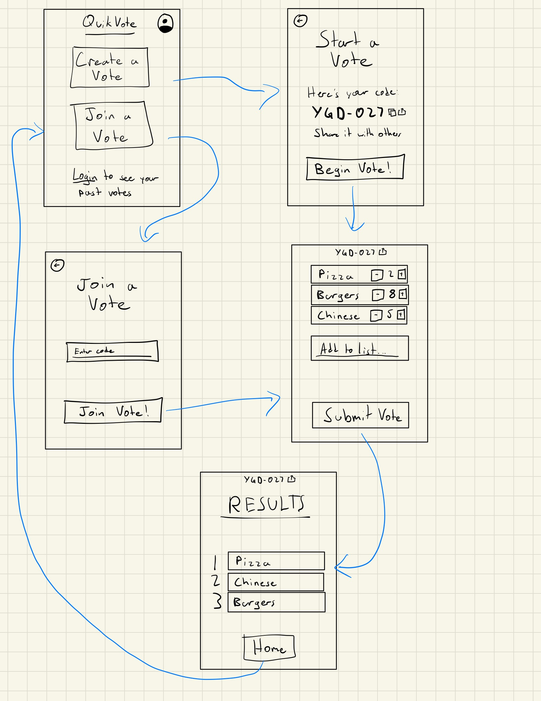

# [QuikVote](https://startup.quikvote.click/)

Struggling to decide what to do with friends? Whether it’s picking a
restaurant, movie, or activity, **QuikVote** makes group decisions fast and fair.
Simply create a vote room, share it, and let everyone vote simultaneously.
Don’t like the options? Add a new one in seconds! Once the votes are in,
the results are clear, and you can get on with your plans. Make decisions
effortlessly with **QuikVote**—the quick, easy solution to group indecision!

## Key features

* Create/join a QuikVote room
* Easily add voting choices
* Vote!
* View results
* Create an account to save/view past QuikVotes

## Technologies used

* **HTML** - Uses correct HTML structure for application. 6-7 HTML pages:
    * Home, with links to Create QuikVote, Join QuikVote, Login
    * Create a QuikVote, with link to QuikVote room
    * Join QuikVote, with link to QuikVote room
    * QuikVote room, with link to Results
    * Results, with link to Home
    * Login, with link to Home
    * Past QuikVotes, with link to Home
* **CSS** - Responsive styling designed for mobile first. Follows good design patterns.  
* **JavaScript** - Provides login, entering a room code, voting and adding choices, backend endpoint calls.  
* **React** - Single page application with reusable and reactive components.  
* **Service** - Backend service with endpoints for:
    * Reading/writing choices
    * Submitting votes
    * Calculating vote results
    * Displaying a random icon picture for the room using the [dicebear](https://www.dicebear.com/) service
* **DB/Login** - Store users, choices, and past QuikVotes in database. Register and login users.
Credentials securely stored in database. Can't save/view past QuikVotes unless authenticated.  
* **WebSocket** - When a user adds a choice, the choices are updated to all users.
Once all users submit their votes, all users are shown the option to view the results.  

## Mockup

## HTML Deliverable

For this deliverable I built out the structure of my application using HTML.

* [x] HTML pages - Seven HTML pages that represent the [home page](./html/index.html) and the ability to [create](./html/new.html)/[join](./html/join.html) a new vote, [vote](./html/vote.html), see the [results](./html/results.html), [login/register](./html/login.html), and view [past votes](./html/history.html).
* [x] Links - Each page links to it's relevent pages.
* [x] Text - There is text throughout the app telling the user how to use it.
* [x] 3rd party call - The [create](./html/new.html)/[join](./html/join.html) a vote pages will call the [dicebear](https://www.dicebear.com/) api to generate a unique image for that vote room.
* [x] Images - There is a "unique" icon shown when you [create](./html/new.html) a vote, and users can expect a matching one when they try to [join](./html/join.html) the same vote.
* [x] DB/Login - [Login page and form](./html/login.html). [Past votes](./html/history.html) are stored in DB. [Vote rooms](./html/vote.html) are stored in DB during their life time.
* [x] WebSocket - [Vote rooms](./html/vote.html) will allow people to add new options and see/vote for all the options that other people have added in real time.

## CSS Deliverable

For this deliverable I built out the styling of my application using CSS.

* [x] Header, footer, and main content body - Header and Footer stay put, main content takes up rest of space and scrolls when needed.
* [x] Navigation elements - Icons in header and buttons in main content for navigation.
* [x] Responsive to window resizing - Simple but effective responsive design.
* [x] Application elements - Buttons, input fields, ordered/unordered lists. 
* [x] Application text content - Raleway font for QuikVote header, Open Sans for everything else.
* [x] Application images - Centered and sized unique "room" images

## React Deliverable

For this deliverable I converted my app to a React single-page application.

* [x] Bundled using Vite - I used Vite to test, build, and bundle my frontend code.
* [x] Multiple react components that implement or mock all app functionality - All pages are a react component (some break up into more components). All functionality is either implemented or mocked and meant to comunicate with the server.
* [x] React router - I use the react router in app.jsx to handle routing.
* [x] React hooks - I use at least one react hook in many if not all react components. I use useState, useEffect, and useContext.

## [Notes](./notes.md)
